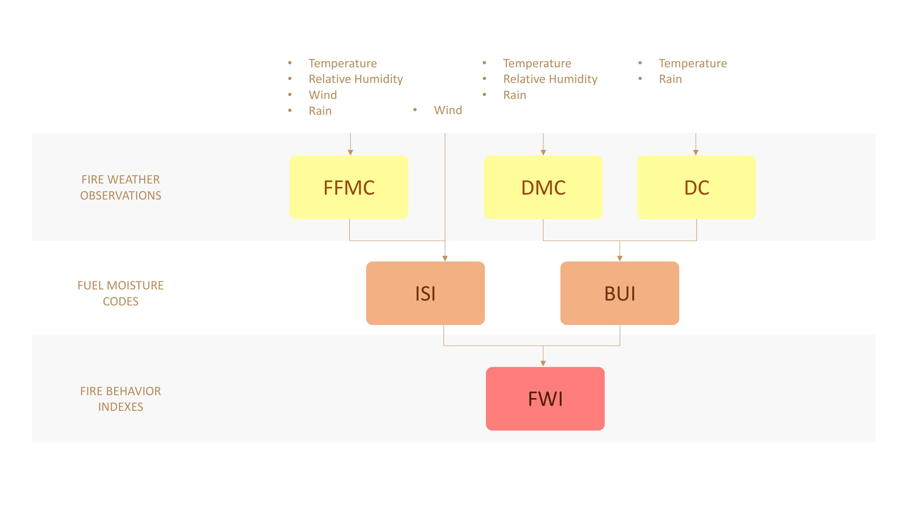

# **Analyze  the potential factors of wildfire in Montesinho Natural Park**

## Description(Describe by words and images alike)

* **The Montesinho Natural Park**

  The Montesinho Natural Park is a protected area located in the northeastern Portugal. It is one of the largest natural parks in Portugal.

  The geological diversity of this space and variations in soil characteristics and climate, originate a highly varied plant life, and an ideal habitat for animals. Its biodiversity includes the Iberian wolf, roe deer, wild boar, Iberian lynx, common genet, red fox, European otter, and around 240 other animal species.

* ### Forest Fire Weather Index (FWI) System

  The Forest Fire Weather Index (FWI) System is an estimation of risk of wildfire. It includes six components: FFMC, DMC, DC, ISI, BUI, FWI.

  The first three components are fuel moisture codes. The three values rise as the moisture content decreases.

  The remaining three components are fire behavior indexes. The three values rise as the fire danger increases.

  The figure below illustrates the six components of the FWI System.

  

## Demo(Images, Video links, Live Demo links)

## Technologies Used

## Technical Description of your project like- Installation, Setup, How to contribute.
